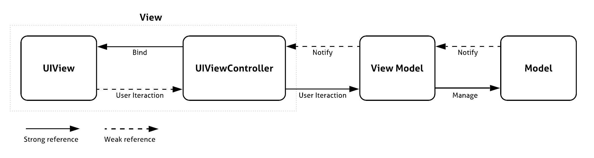

# MVVMKit

[](https://cocoapods.org/pods/MVVMKit)
[](https://cocoapods.org/pods/MVVMKit)
[](https://cocoapods.org/pods/MVVMKit)


MVVMKit is a protocol oriented library that defines a possible way to adopt the MVVM in your iOS application.
Optionally MVVMKit give you the possibility to take out the navigation responsibility from the view model and put it inside a `Coordinator` type.

In general using MVVMKit most of your software types should belong to one of the following categories:

## Model
The actual data manipulated of your applications. 
Model type can be `NSManagedObject` fetched from a Core Data database or `Codable` instances coming from a web server.

**Responsibilities**
- Maintain the state of the application

## UIView
The user interface. On iOS views are typically subclasses of `UIView`.

**Responsibilities**
- Show the application content.
- Deliver the user interaction to the a `UIViewController`

## UIViewController
A subclass of `UIViewController`

**Responsibilities**
- Deliver the user interaction to the a View Model
- Bind the View Model on the view

Note: on iOS we divide the View entity of the MVVM pattern in two entities: `UIView` and `UIViewController`.

## View Model
The actual "brain" of a scene of your application.

Responsibilities:
- Manage the model
- Present the model in way it is immediately suitable for the view
- Notify the view controller when it should update the view (a.k.a. make a bind)

## Coordinator
Is the entity responsible for the application navigation.

**Responsibilities**
- Decide which is (and how to show) the next view controller 
- Instantiate view controllers and associated view models doing appropriate dependency injection

##

**Grapical representation**



## Example

To run the example project, clone the repo, and run `pod install` from the Example directory first.


## Installation

MVVMKit is available through [CocoaPods](https://cocoapods.org). To install
it, simply add the following line to your Podfile:

```ruby
pod 'MVVMKit'
```

## Author

[alfogrillo](https://github.com/alfogrillo)

## License

MVVMKit is available under the MIT license. See the LICENSE file for more info.
