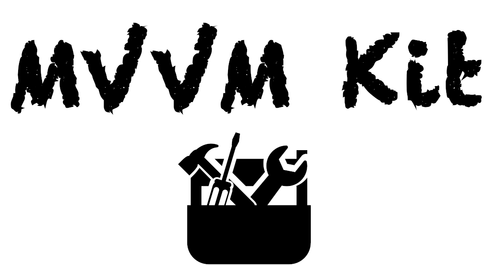

<p align="center" >
  
</p>

<p align="center"><strong>A Protocol Oriented MVVM implementation</strong></p>

[](https://cocoapods.org/pods/MVVMKit)
[](https://cocoapods.org/pods/MVVMKit)
[](https://cocoapods.org/pods/MVVMKit)


**MVVMKit** is a protocol oriented library that defines a clear way to adopt the [MVVM software architecture](https://en.wikipedia.org/wiki/Model–view–viewmodel) in your iOS applications.<br/>
Aside the classical MVVM implementation, **MVVMKit** also provides the tools for putting the navigation logics inside instances conforming to the `Coordinator` protocol.

- [Introduction](#introduction)
- [Features](#features)
- [Templates](#templates)
- [Installation](#installation)

</br>

## Introduction

When you use **MVVMKit** most of your software types will belong to one of the following categories:

#### Model

The actual data manipulated by your applications.</br>
Model types can be `NSManagedObject` fetched from a Core Data database or `Codable` instances coming from a web API.

Model’s responsibilities:
- Maintain the state of the application

</br>

#### UIView

The actual user interface.</br> 
On iOS views are typically subclasses of `UIView`.

UIView’s responsibilities:
- Show the application content
- Deliver the user interaction to a `UIViewController`

</br>

#### UIViewController
A subclass of `UIViewController`.

UIViewController’s responsibilities
- Deliver the user interaction to the View Model
- Bind the View Model properties to the view

**Note**: on iOS we divide the **View** entity of the MVVM pattern in two entities: `UIView` and `UIViewController`.

</br>

#### View Model
The actual "brain" of a scene of your application, containing most of your application’s logic.

View Model’s responsibilities:
- Manage the model
- Present the model in a way that is immediately suitable for the view
- Notify the view controller when it should update the view

</br>

#### Coordinator
The entity responsible for the application navigation.

Coordinator’s Responsibilities
- Decide which is, and how to show the next view controller 
- Instantiate view controllers and associated view models doing the appropriate dependency injections

</br>

#### Graphical representation


## Features

- [X] ⚙️ Protocol Oriented
- [X] 🖼 Reusable View support (cells, supplementary views)
- [X] 🔨 Diffable Data Source ready
- [X] 📌 Combine bindings
- [X] 🧩 Embedding
- [X] 👆🏼 Custom cell interaction
- [X] 🧭 Coordinator support


</br>

## Code Examples

- [Coordinated Navigation](#Coordinated-Navigation)
- [Diffable Data Source](#Diffable-Data-Sources)
- [Embed a view controller](#Embed-a-view-controller)
- [Custom Cell Interaction](#Custom-Cell-Interaction)


#### Coordinated Navigation

The view controller forwards the user interaction to the view model.
```swift
class RootViewController: UIViewController, ViewModelOwner {
    typealias ViewModelType = RootViewModel
    var viewModel: RootViewModel!
    
    func bind(viewModel: RootViewModel) { … }
    
    @IBAction func didTapButton(_ sender: UIButton) {
        viewModel.didTapButton()
    }
}
```
<br/>

The view model starts the navigation using the coordinator.
```swift
class RootViewModel: CoordinatedViewModel {
    typealias CoordinatorType = RootCoordinator
    let coordinator: RootCoordinator
    
    init(coordinator: RootCoordinator) { … }
    
    func didTapButton() {
        coordinator.showDestinationViewController()
    }
```
<br/>

The coordinator instantiates and makes the approriate dependency injection in the destination scene.

```swift
class RootCoordinator: Coordinator {
    let weakViewController: WeakReference<UIViewController>
    
    init(sourceViewController viewController: UIViewController) { … }
    
    func showDestinationViewController() {
        let viewController = SomeViewController()
        viewController.viewModel = SomeViewModel()
        self.viewController?.show(viewController, sender: nil)
    }

```

#### Diffable Data Sources


Define the cell and the cell’s view model.
```swift
struct MyCellViewModel: ReusableViewViewModel {
    let identifier: String = MyCell.identifier
    let text: String?
}

class MyCell: UICollectionViewCell, CustomBinder {
    typealias ViewModelType = MyCellViewModel

    @IBOutlet private var label: UILabel!

    func bind(viewModel: ViewModelType) {
        label.text = viewModel.text
    }
}

```
<br/>

Conform the scene’s view model to `DiffableCollectionViewViewModel`.<br/>
Additionally add the logic for publishing the data source snapshots.
```swift
class MyViewModel: DiffableCollectionViewViewModel {
    typealias SectionType = Section

    private let state: CurrentValueSubject<[MySectionModel], Never> = .init([])

    enum Section {
        case main
        case second
    }

    var snapshot: AnyPublisher<SnapshotAdapter, Never> {
        state
            .map(createSnapshot(from:))
            .eraseToAnyPublisher()
    }

    func createSnapshot(from: [MySectionModel]) -> SnapshotAdapter {
        // create your snapshot here
        .init()
    }
}
```

<br/>

Subclass `MVVMDiffableCollectionViewController`.

```swift
class MyViewController: MVVMDiffableCollectionViewController<MyViewModel> { }
```
<br/>


#### Embed a view controller
Conform the view controller to `ContainerViewProvider`.

```swift
class ContainerViewController: UIViewController, ViewModelOwner, ContainerViewProvider {
    typealias ViewModelType = ContainerViewModel
    
    @IBOutlet weak private var containerView: UIView!
    
    var viewModel: ContainerViewModel!
    
    func view(for kind: ContainerViewKind) -> UIView? {
        switch kind {
        case .main:
            return containerView
        }
    }
}
```
<br/>

Conform the coordinator to `EmbedderCoordinator`.

```swift
final class ContainerCoordinator: EmbedderCoordinator {
    typealias ViewController = ContainerViewController
    typealias ContainerViewKind = ViewController.ContainerViewKind
    
    func embedChildViewController(in view: ContainerViewKind) {
        let childViewController = ChildViewController()
        guard let containerView = viewController?.view(for: view) else {
            return
        }
        // embed here ‘childViewController’ into the ‘containerView’
    }
```
<br/>
Start the embedding process in the view model specifying the desired view identifier.

```swift
final class ContainerViewModel: CoordinatedViewModel {
    typealias Coordinator = ContainerCoordinator
    
    let coordinator: ContainerCoordinator

    func didTapSomething() {
        coordinator.embedChildViewController(in: .main)
    }
```
<br/>

#### Custom Cell Interaction
Conform the cell’s view model to `ReusableViewViewModel`.

```swift
struct SampleCellViewModel: ReusableViewViewModel {
	let identifier: String = SampleCell.identifier
	let text: String?
}
```
<br/>

Create a delegate for your cell’s custom interaction and conform the cell to `CustomDelegator` protocol.<br/>
Addtionally you need to conform the cell to `CustomBinder` where you make the usual view model’s properties binding.

```swift
protocol SampleCellDelegate: class {
    func didTapButton(in sampleCell: SampleCell)
}

class SampleCell: UICollectionViewCell, CustomBinder, CustomDelegator {
    typealias ViewModelType = SampleCellViewModel
    typealias Delegate = SampleCellDelegate
    
    @IBOutlet private weak var titleLabel: UILabel!
    
    func bind(viewModel: SampleCellViewModel) {
        titleLabel.text = viewModel.text
    }
    
    @IBAction func didTapButton(_ sender: UIButton) {
        delegate?.didTapButton(in: self)
    }
}

```
<br/>

Conform the scene’s view controller to the cell’s delegate protocol to get the events delivered.
```swift

extension SampleViewController: SampleCellDelegate {
    func didTapButton(in sampleCell: SampleCell) {
        guard let indexPath = collectionView.indexPath(for: sampleCell) else { return }
        viewModel.didTapButton(at: indexPath)
    }
}

```


## Templates

Copy the `Templates/MVVMKit` folder into `~/Library/Developer/Xcode/Templates`.

The result should be the following:


## Installation

**MVVMKit** is available through [CocoaPods](https://cocoapods.org). To install
it, simply add the following line to your Podfile:

```ruby
pod 'MVVMKit'
```

**MVVMKit** is also available as a **Swift Package**.


### Example project

To run the example project, clone the repo, and run `pod install` inside the `Example` directory first.

## Author

[alfogrillo](https://github.com/alfogrillo)

## License

**MVVMKit** is available under the MIT license. See the LICENSE file for more info.

